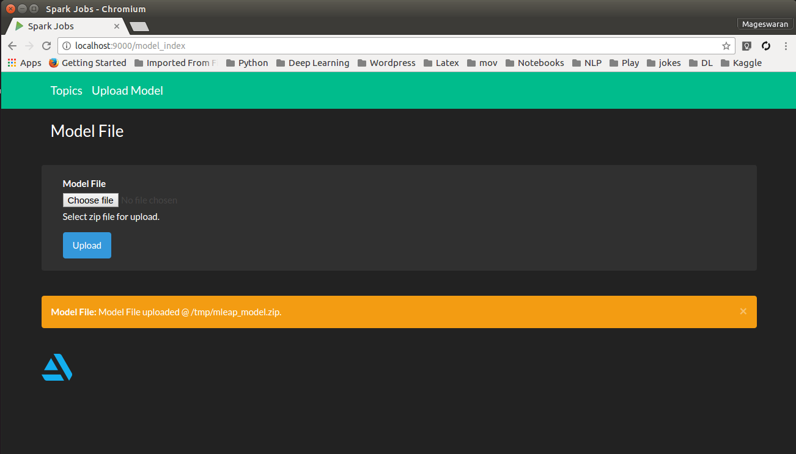
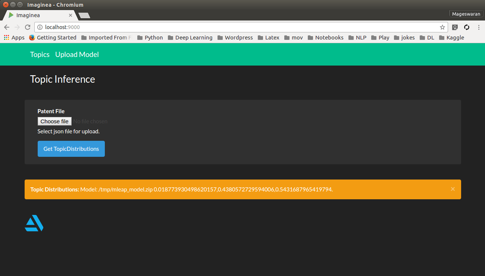

# Mleap with Spark and Play-Scala

A sample project to show how to integrate: 
- Mleap with Apache Spark to generate the MLeap model file.
- MLeap with Play Framework in Scala to build a small micro service to load the model and to test on new documents.

This only shows how to integrate Spark + MLeap and Mleap + Play Framework.
**Please ignore the dataset used as it doesn't imply the intent of this example**

## Following are the dependent modules:  
- Spark ML
- MLeap
- Play Frameowrk
- Scala Protobuf

## How To Run?
1. Go to root of the project 
    - $ sbt
    - $ run 7654
    - Goto to [http://localhost/7654](http://localhost/7654), which will trigger actual compiling and you will see  
    
    - Click "Upload Model" tab upload the [mleap_model.zip](src/main/resources/)
    - Click "Topics" tab and upload the [test.json](src/main/resources/) 
    
    - Now the project is good to import in IntelliJ, if you haven't done so.
    - After importing, goto [LDAJob.scala](src/main/scala/LDAJob.scala) and run it
    - Which will create a MLeap model in /tmp/mleap_model.zip, for reference check out [here](src/main/resources/) 
    - Up to you next...
    
    
**Known Issues**
1. Some times logs tend to print all debug statements
2. Dataset (call it as a text file, where each line is a document for us ;) ) is a not good one indeed! 

**TODO**  
Replace above text file with known good dataset for topic modeling.

## Any issues?
 - Raise a ticket against mageswaran1989 in Git or mail me mageswaran1989@gmail.com